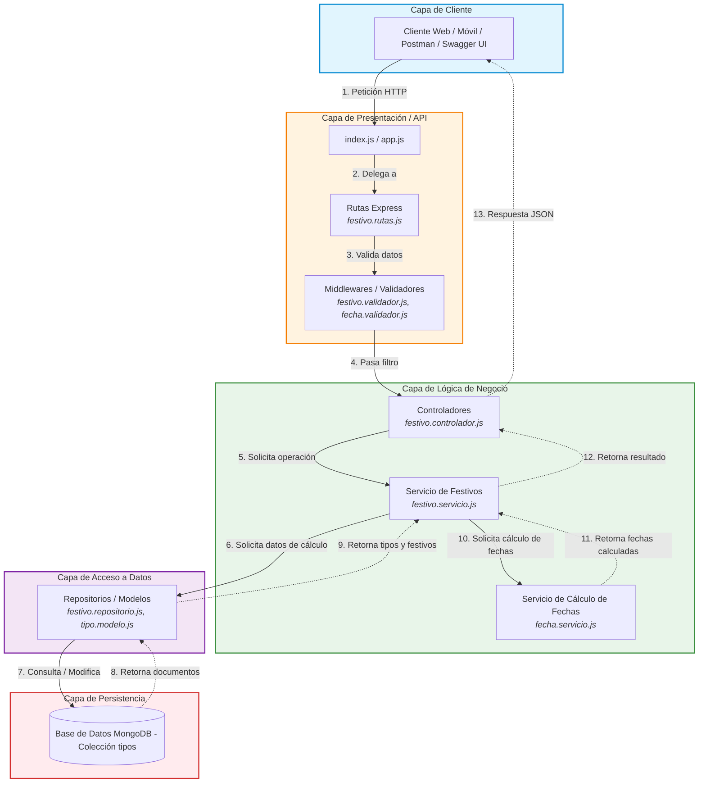

# Diagrama de Arquitectura por Capas - API Festivos

API RESTful desarrollada en Express JS sobre MongoDB.

La arquitectura organiza los componentes en capas jerárquicas horizontales, donde
cada capa tiene una responsabilidad única y solo interactúa con la capa
inmediatamente inferior, o con la superior al responder.

## Responsabilidad de cada capa

| Capa | Responsabilidad |
|---|---|
| Capa de Cliente | Consume la API mediante peticiones HTTP |
| Capa de Presentación / API | Recibe la petición, enruta hacia el controlador y valida los datos de entrada |
| Capa de Lógica de Negocio | Ejecuta las operaciones de la API y realiza el cálculo de las fechas festivas |
| Capa de Acceso a Datos | Traduce las operaciones de negocio en consultas y modificaciones sobre MongoDB |
| Capa de Persistencia | Almacena la colección `tipos` con los datos para calcular los festivos |

## Operaciones de la API

| Operación | Método | Ruta |
|---|---|---|
| Listar festivos | GET | `/api/festivos` |
| Obtener un festivo | GET | `/api/festivos/:id` |
| Agregar un festivo | POST | `/api/festivos/agregar` |
| Modificar un festivo | PUT | `/api/festivos/modificar/:id` |
| Eliminar un festivo | DELETE | `/api/festivos/:id` |
| Verificar si una fecha es festiva | GET | `/api/festivos/verificar/:anio/:mes/:dia` |
| Listar los festivos de un año | GET | `/api/festivos/obtener/:anio` |

El CRUD opera sobre los datos de cálculo de los festivos, no sobre fechas. Por ejemplo,
agregar el festivo de la Virgen de Chiquinquirá consiste en registrar su día, mes y el
tipo de festivo al que pertenece.

La operación **listar los festivos de un año** es la que consume la API Calendario
desarrollada en Spring Boot.

## Servicio de Cálculo de Fechas

Componente que aísla la lógica de fechas, requerida por la verificación de fecha
festiva y por el listado de festivos de un año.

Sus responsabilidades son:

- Calcular el domingo de Pascua de un año a partir de la fórmula
  `dias = d + (2b + 4c + 6d + 5) MOD 7`, donde `a = Año MOD 19`, `b = Año MOD 4`,
  `c = Año MOD 7` y `d = (19a + 24) MOD 30`. El resultado son los días transcurridos
  después del 15 de marzo hasta el domingo de Ramos, y el domingo de Pascua es 7 días
  después.
- Sumar o restar los días indicados en `diasPascua` a la fecha del domingo de Pascua,
  para los festivos de tipo 3 y 4.
- Trasladar una fecha al siguiente lunes, para los festivos de tipo 2 y 4.
- Validar que una fecha recibida sea una fecha válida del calendario.
