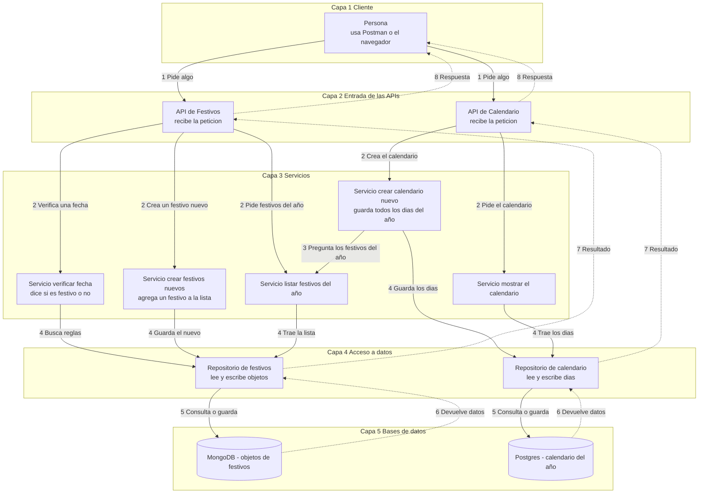

```mermaid
graph TD
    %% Piso 1: quien usa el sistema
    subgraph CapaCliente [Capa 1 Cliente]
        Cliente["Persona<br/>usa Postman o el navegador"]
    end

    %% Piso 2: las dos puertas de entrada - las 2 APIs
    subgraph CapaEntrada [Capa 2 Entrada de las APIs]
        EntradaFestivos["API de Festivos<br/>recibe la peticion"]
        EntradaCalendario["API de Calendario<br/>recibe la peticion"]
    end

    %% Piso 3: servicios. Aqui esta el servicio para CREAR los nuevos
    subgraph CapaServicios [Capa 3 Servicios]
        SVerificar["Servicio verificar fecha<br/>dice si es festivo o no"]
        SCrearFestivo["Servicio crear festivos nuevos<br/>agrega un festivo a la lista"]
        SListarFestivos["Servicio listar festivos del año"]
        SCrearCalendario["Servicio crear calendario nuevo<br/>guarda todos los dias del año"]
        SListarCalendario["Servicio mostrar el calendario"]
    end

    %% Piso 4: traductores entre servicios y bases de datos
    subgraph CapaAcceso [Capa 4 Acceso a datos]
        RepoFestivos["Repositorio de festivos<br/>lee y escribe objetos"]
        RepoCalendario["Repositorio de calendario<br/>lee y escribe dias"]
    end

    %% Piso 5: donde viven los datos
    subgraph CapaPersistencia [Capa 5 Bases de datos]
        Mongo[(MongoDB - objetos de festivos)]
        Postgres[(Postgres - calendario del año)]
    end

    %% Ida de la peticion - flecha continua
    Cliente -->|"1 Pide algo"| EntradaFestivos
    Cliente -->|"1 Pide algo"| EntradaCalendario

    EntradaFestivos -->|"2 Verifica una fecha"| SVerificar
    EntradaFestivos -->|"2 Crea un festivo nuevo"| SCrearFestivo
    EntradaFestivos -->|"2 Pide festivos del año"| SListarFestivos

    EntradaCalendario -->|"2 Crea el calendario"| SCrearCalendario
    EntradaCalendario -->|"2 Pide el calendario"| SListarCalendario

    %% La API de calendario usa a la API de festivos
    SCrearCalendario -->|"3 Pregunta los festivos del año"| SListarFestivos

    SVerificar -->|"4 Busca reglas"| RepoFestivos
    SCrearFestivo -->|"4 Guarda el nuevo"| RepoFestivos
    SListarFestivos -->|"4 Trae la lista"| RepoFestivos
    SCrearCalendario -->|"4 Guarda los dias"| RepoCalendario
    SListarCalendario -->|"4 Trae los dias"| RepoCalendario

    RepoFestivos -->|5 Consulta o guarda| Mongo
    RepoCalendario -->|5 Consulta o guarda| Postgres

    %% Vuelta de la respuesta - flecha punteada
    Mongo -.->|6 Devuelve datos| RepoFestivos
    Postgres -.->|6 Devuelve datos| RepoCalendario
    RepoFestivos -.->|7 Resultado| EntradaFestivos
    RepoCalendario -.->|7 Resultado| EntradaCalendario
    EntradaFestivos -.->|8 Respuesta| Cliente
    EntradaCalendario -.->|8 Respuesta| Cliente
```