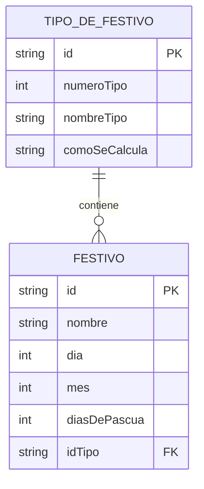

```mermaid
erDiagram
    %% El tipo explica como se calcula el festivo.
    %% Hay 4 tipos: fijo, puente, pascua, y pascua + puente.
    %% El festivo es un objeto con nombre y reglas de fecha.
    TIPO_DE_FESTIVO ||--o{ FESTIVO : contiene

    TIPO_DE_FESTIVO {
        string id PK
        int numeroTipo
        string nombreTipo
        string comoSeCalcula
    }

    FESTIVO {
        string id PK
        string nombre
        int dia
        int mes
        int diasDePascua
        string idTipo FK
    }
```
