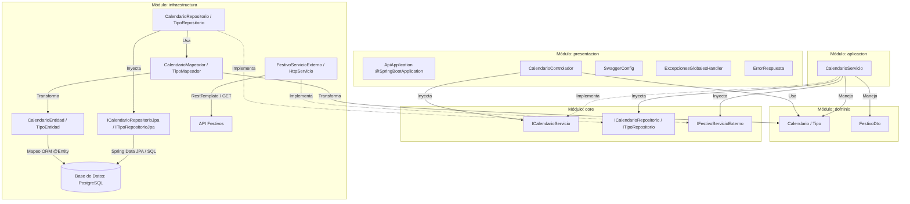

# Diagrama de Arquitectura Onion - API Calendario

API RESTful desarrollada en Spring Boot sobre PostgreSQL. Es cliente de la API Festivos,
de la cual obtiene la lista de festivos de un año.

La arquitectura onion organiza la API en módulos independientes. El dominio y el core
están en el centro: definen los datos y los contratos (interfaces) y no dependen de
ningún framework ni de la base de datos. Los demás módulos implementan o usan esos
contratos, así que **todas las dependencias apuntan hacia el dominio y el core** y
ninguna sale de ellos.

## Relaciones

| Relación | Línea | Significado |
|---|---|---|
| Implementa | punteada | La clase implementa una interfaz definida en el core. No es un llamado directo |
| Inyecta | continua | La clase recibe por inyección de dependencias una instancia que crea Spring (`@Autowired`) |
| Maneja / Usa | continua | La clase trabaja con objetos del dominio o DTOs, que fluyen por todos los módulos |
| Transforma | continua | Los mapeadores convierten entre entidades del dominio y entidades JPA, en los dos sentidos |

Del dominio y del core no sale ninguna flecha, así que la base de datos o la API Festivos
se pueden reemplazar sin cambiar el núcleo ni la lógica de negocio.

## Módulos

La API se divide en cinco módulos Maven.

| Módulo | Contenido | Dependencia de framework |
|---|---|---|
| dominio | Entidades del dominio (`Calendario`, `Tipo`) y DTOs (`FestivoDto`) | Ninguna, Java puro |
| core | Interfaces de servicio, de repositorio y de integración externa | Ninguna, Java puro |
| aplicacion | Implementación de los servicios (`@Service`), con la lógica de negocio | Spring |
| infraestructura | Persistencia (entidades JPA, repositorios JPA, implementación de los repositorios y mapeadores) e integración con la API Festivos | Spring Data JPA, `RestTemplate` |
| presentacion | Clase principal, controladores REST, configuración de Swagger y manejo global de excepciones | Spring Web |

Los repositorios JPA son interfaces que extienden `JpaRepository`. No se programan: Spring
Data JPA los implementa automáticamente.

## Operaciones de la API

| Operación | Método | Ruta | Respuesta |
|---|---|---|---|
| Generar el calendario de un año | GET | `/api/calendario/generar/:anio` | `true` si el proceso terminó con éxito |
| Listar el calendario de un año | GET | `/api/calendario/listar/:anio` | Lista de días con su fecha, tipo y descripción |

## Flujo de generar el calendario

1. El cliente llama `GET /api/calendario/generar/:anio`.
2. `CalendarioControlador` invoca `ICalendarioServicio`. Spring inyecta la implementación
   `CalendarioServicio`.
3. `CalendarioServicio` pide los festivos del año a `IFestivoServicioExterno`. Su
   implementación, `FestivoServicioExterno`, llama `GET /api/festivos/obtener/:anio` de la
   API Festivos con el `RestTemplate` configurado en `HttpServicio` y convierte el JSON
   recibido en objetos `FestivoDto`.
4. `CalendarioServicio` recorre los días del 1 de enero al 31 de diciembre y clasifica cada
   uno como *Día festivo* si está en la lista de festivos, como *Fin de semana* si es sábado
   o domingo, o como *Día laboral* en los demás casos.
5. `CalendarioServicio` elimina los días que ya existan para ese año, para que generar el
   mismo año dos veces no duplique registros, y guarda los nuevos a través de
   `ICalendarioRepositorio`.
6. `CalendarioRepositorio` transforma los objetos del dominio en `CalendarioEntidad` con
   `CalendarioMapeador` y los guarda en PostgreSQL con `ICalendarioRepositorioJpa`.
7. El controlador responde `true` con código 200. Si la API Festivos no responde o falla el
   guardado, responde `false`.

Listar el calendario recorre el camino inverso: el repositorio JPA consulta los días del
año, el mapeador los transforma en objetos del dominio y el controlador los serializa a JSON.

## Decisiones de diseño

- **La API Festivos es una integración externa.** El core define la interfaz
  `IFestivoServicioExterno` y la llamada HTTP se implementa en la infraestructura, en
  `FestivoServicioExterno`. Si la API Festivos cambia, el servicio no se modifica.
- **`FestivoDto` es un DTO, no una entidad.** Representa cada festivo que entrega la API
  Festivos (`festivo` y `fecha`), no se guarda en la base de datos y solo se usa para
  clasificar los días.
- **En el dominio, `Calendario` contiene un objeto `Tipo`, no un `IdTipo`.** La llave
  foránea solo existe en la entidad JPA, con `@ManyToOne` y `@JoinColumn`. Por eso la
  respuesta de listar incluye el tipo completo (`"tipo": {"id": 3, "tipo": "Día festivo"}`).
- **No hay CRUD de `Tipo`.** Es un catálogo fijo de tres registros.
- **La seguridad por token no se incluye.** El profesor indicó que es opcional para esta
  API. Por eso, frente al diagrama de ejemplo de la API Monedas, no aparecen la entidad
  `Usuario`, los componentes de seguridad de la aplicación ni `ConfiguracionSeguridad`.

El modelo de la base de datos está en el
[diagrama relacional](diagrama-relacional-api-calendario.md).
